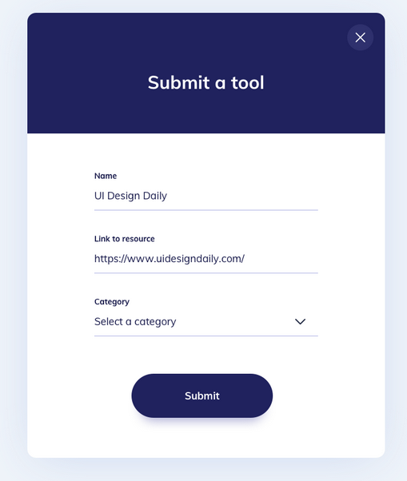
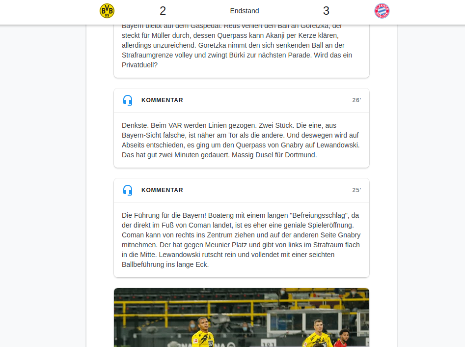

# tiqhub-frontend

The goal of tiqhub is to enable users to create and share a ticker for any event.

### User stories
- [ ] User can start a ticker with a name
- [ ] User can publish messages to the ticker
- [ ] User can view the ticker using a link

### Design inspiration



Source: [UI Design Daily](https://uidesigndaily.com/posts/sketch-submit-form-day-1189)



Source: Google Bundesliga Ticker

### Built with
- [Vue.js](https://vuejs.org/)

## Getting started
```
npm install
```

### Compiles and hot-reloads for development
```
npm run serve
```

### Compiles and minifies for production
```
npm run build
```

### Lints and fixes files
```
npm run lint
```
